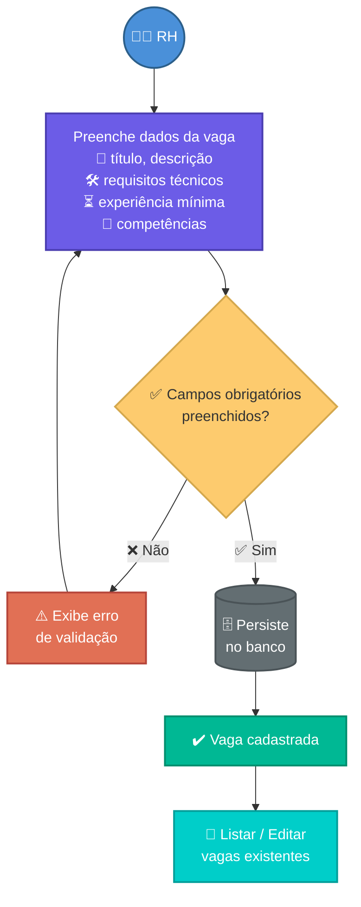
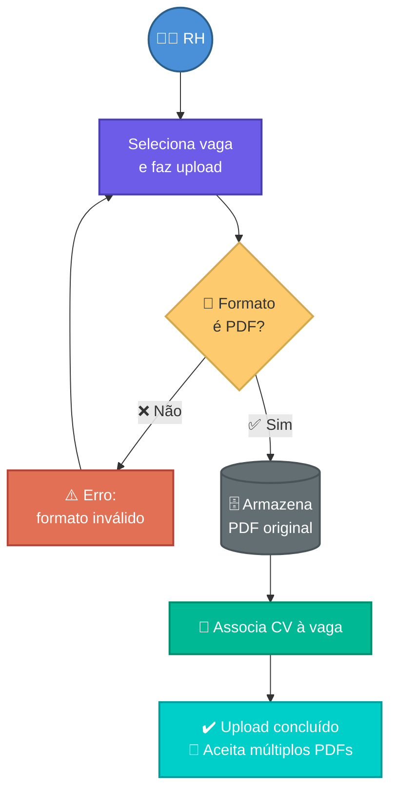
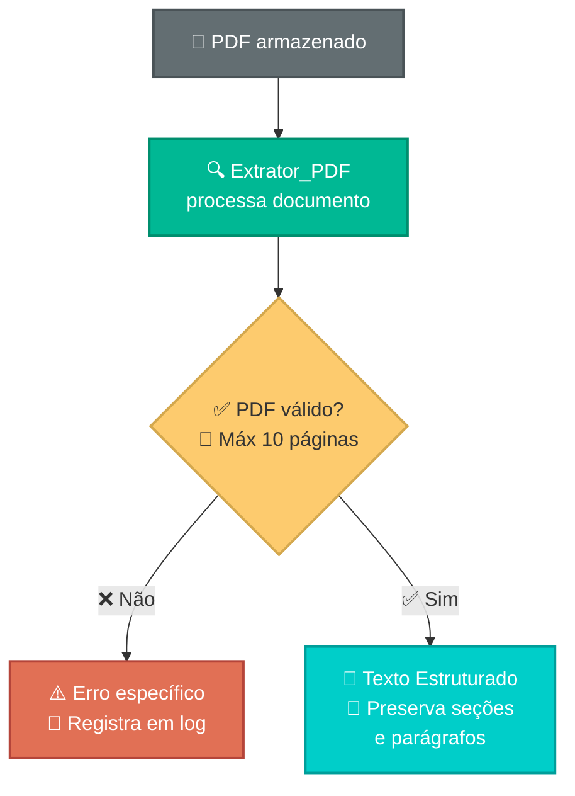
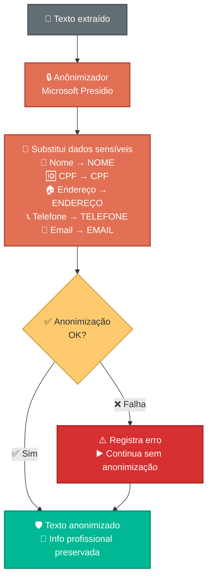
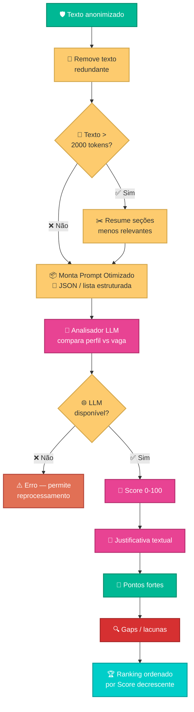
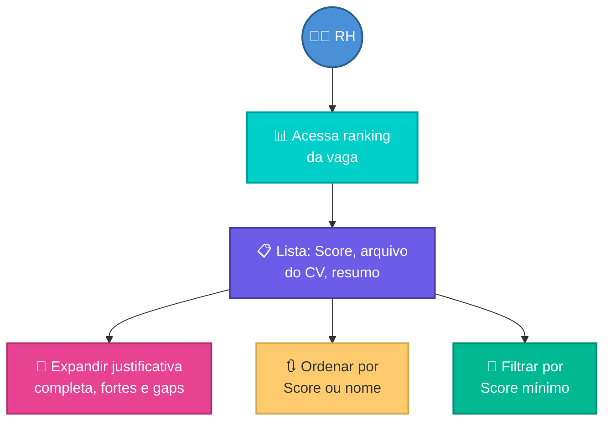

# 📊 Diagrama UML — Fluxos do Sistema

O diagrama abaixo unifica todos os requisitos e user stories do sistema ConectaTalentos, mostrando como os fluxos se conectam desde o cadastro de vagas até a visualização do ranking final.

---

## 🔄 Pipeline Principal

Visão geral do fluxo completo do sistema, do cadastro à decisão do RH:

```mermaid
flowchart LR
    A(("🧑‍💼\nRH"))
    B["📋 Cadastro\nde Vaga"]
    C["📄 Upload\nde CVs"]
    D["🔍 Extração\nde Texto"]
    E["🔒 Anonimização\nLGPD"]
    F["⚡ Otimização\nde Tokens"]
    G["🤖 Análise\nLLM"]
    H[("🗄️\nBanco")]
    I["🏆 Ranking\nFinal"]

    A --> B --> C --> D --> E --> F --> G --> H --> I --> A

    style A fill:#4A90D9,stroke:#2C5F8A,color:#fff,stroke-width:2px
    style B fill:#6C5CE7,stroke:#4A3DB0,color:#fff,stroke-width:2px
    style C fill:#6C5CE7,stroke:#4A3DB0,color:#fff,stroke-width:2px
    style D fill:#00B894,stroke:#008E6E,color:#fff,stroke-width:2px
    style E fill:#E17055,stroke:#B5453A,color:#fff,stroke-width:2px
    style F fill:#FDCB6E,stroke:#D4A84E,color:#333,stroke-width:2px
    style G fill:#E84393,stroke:#B5306F,color:#fff,stroke-width:2px
    style H fill:#636E72,stroke:#4A5357,color:#fff,stroke-width:2px
    style I fill:#00CEC9,stroke:#009E9A,color:#fff,stroke-width:2px
```

---

## 📋 Req 1 — Cadastro de Vagas

---

## 📄 Req 2 — Upload de Currículos

---

## 🔍 Req 3 — Extração de Texto

---

## 🔒 Req 4 — Anonimização LGPD

---

## ⚡ Req 5 e 6 — Otimização de Tokens + Análise LLM

---

## 🏆 Req 7 — Visualização de Resultados

---

## 🌐 Req 8 — Interface Web + 🗄️ Req 9 — Persistência + ⚠️ Req 10 — Erros

```mermaid
flowchart LR
    subgraph WEB["🌐 Interface Web"]
        W1["🖥️ Responsivo desktop"]
        W2["📑 Páginas:\nVagas · Upload · Rankings"]
        W3["⏳ Feedback visual:\nloading · progresso"]
    end

    subgraph DB["🗄️ Persistência"]
        D1["💾 Vagas cadastradas"]
        D2["📄 PDFs armazenados"]
        D3["📊 Scores e rankings"]
        D4["🔄 Recuperação pós-restart"]
        D5["🗑️ Exclusão em cascata"]
    end

    subgraph ERR["⚠️ Tratamento de Erros"]
        E1["📄 Falha no Extrator → msg PDF"]
        E2["🔒 Falha Anônimizador → continua"]
        E3["🤖 Falha LLM → reprocessar"]
        E4["📎 Falha upload → msg erro"]
        E5["📝 Log de todos os erros"]
    end

    WEB --> DB
    WEB --> ERR

    style W1 fill:#4A90D9,stroke:#2C5F8A,color:#fff,stroke-width:2px
    style W2 fill:#4A90D9,stroke:#2C5F8A,color:#fff,stroke-width:2px
    style W3 fill:#4A90D9,stroke:#2C5F8A,color:#fff,stroke-width:2px
    style D1 fill:#636E72,stroke:#4A5357,color:#fff,stroke-width:2px
    style D2 fill:#636E72,stroke:#4A5357,color:#fff,stroke-width:2px
    style D3 fill:#636E72,stroke:#4A5357,color:#fff,stroke-width:2px
    style D4 fill:#636E72,stroke:#4A5357,color:#fff,stroke-width:2px
    style D5 fill:#636E72,stroke:#4A5357,color:#fff,stroke-width:2px
    style E1 fill:#E17055,stroke:#B5453A,color:#fff,stroke-width:2px
    style E2 fill:#E17055,stroke:#B5453A,color:#fff,stroke-width:2px
    style E3 fill:#E17055,stroke:#B5453A,color:#fff,stroke-width:2px
    style E4 fill:#E17055,stroke:#B5453A,color:#fff,stroke-width:2px
    style E5 fill:#E17055,stroke:#B5453A,color:#fff,stroke-width:2px
```

